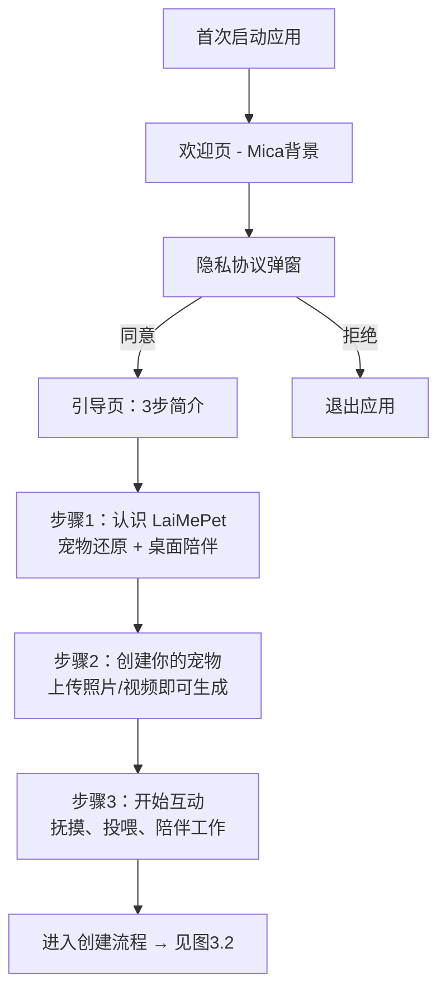
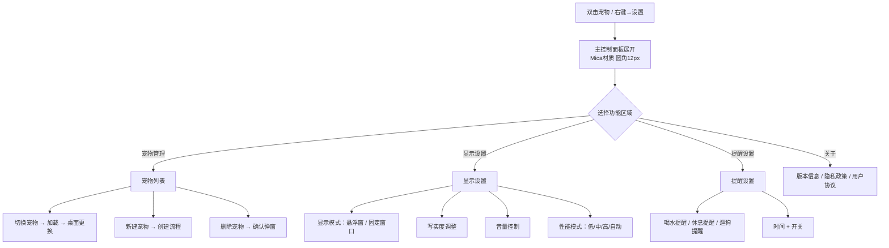
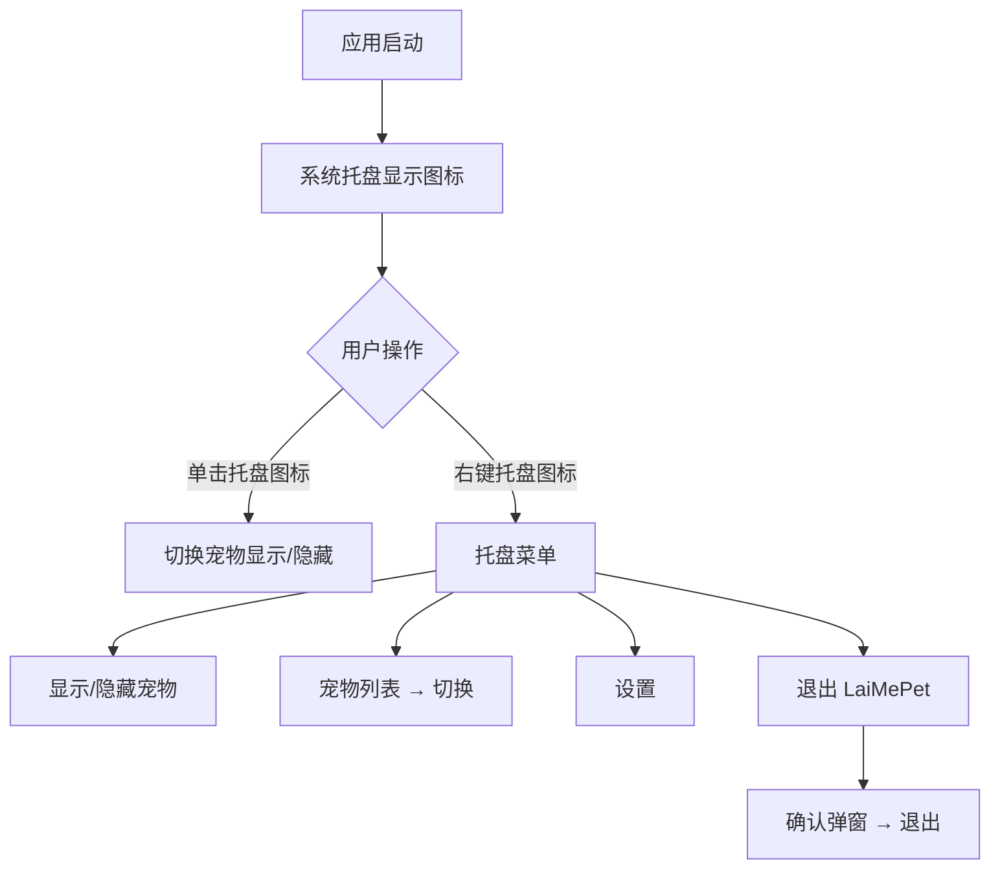

# LaiMePet 交互设计 — V1.0

> **版本**：v1.0
> **日期**：2026-07-01
> **作者**：UI/UX 设计师
> **状态**：初稿 / 待评审
> **依赖**：[design-system.md](design-system.md)

---

## 1. 交互设计原则

| 原则 | 说明 |
|------|------|
| **即时反馈** | 每次用户操作 100ms 内给到视觉反馈，不让用户等待 |
| **渐进呈现** | 常用操作（抚摸）零层级触达；次要操作（设置）渐进展开 |
| **容错可逆** | 误操作可撤销（关闭面板而非确认销毁），不给用户恐慌感 |
| **桌面不打扰** | 自主行为不抢焦点、不弹窗打断工作流（除用户预设提醒）|
| **宠物即界面** | 宠物本体是最主要的交互入口（点击/拖拽/悬停），减少 UI 控件依赖 |

---

## 2. 交互层级模型

```
┌─────────────────────────────────────────┐
│  Layer 0: 桌面自主层（无操作）             │
│  宠物自主行为循环，无 UI                    │
│                                           │
│  Layer 1: 即时互动层（直接操作宠物）         │
│  抚摸(点击) / 投喂(拖拽) → 反应动画         │
│                                           │
│  Layer 2: 悬停发现层（鼠标靠近）             │
│  心情指示器(常驻) + 悬停控制条(浮现)         │
│                                           │
│  Layer 3: 快捷菜单层（右键）                │
│  右键菜单（Acrylic）→ 快捷操作入口          │
│                                           │
│  Layer 4: 完整面板层（双击/托盘）            │
│  主控制面板（Mica）→ 设置、宠物管理          │
└─────────────────────────────────────────┘
```

> **层级递减原则**：从 Layer 0 → Layer 4，操作频率递减，UI 干扰递增。用户 80% 时间停留在 Layer 0-1。

---

## 3. 核心用户流程

### 3.1 首次启动 → 创建宠物



### 3.2 创建宠物（核心流程）

```mermaid
flowchart TD
    A[点击"创建我的宠物"] --> B[上传素材界面]
    B --> B1{选择上传方式}
    B1 -->|本地文件| B2[文件选择器<br/>支持 JPG/PNG/MP4/MOV]
    B1 -->|拖拽文件夹| B2
    B2 --> C[素材预览网格]
    C --> C1{质量检查}
    C1 -->|图片 <5张| C2[提示：至少需要5张<br/>当前：N张]
    C2 --> B
    C1 -->|通过| D[写实度配置]
    
    D --> D1[写实度滑块]
    D1 --> D2["0 ←→ 100<br/>左：卡通Q版<br/>右：最大写实"]
    D2 --> D3{选择生成方式}
    D3 -->|本地模型| D4[自动检测硬件<br/>显示预计耗时]
    D3 -->|云端API| D5[显示隐私说明<br/>上传素材到云端]
    
    D4 --> E[点击"开始生成"]
    D5 --> E
    
    E --> F[生成等待页]
    F --> F1[进度动画<br/>骨架屏+阶段提示]
    F1 --> F2{生成结果}
    F2 -->|失败| F3[错误提示+建议]
    F3 -->|补充素材| B
    F3 -->|降低写实度| D
    F3 -->|切换生成方式| D3
    F2 -->|成功| G[形象预览页]
    
    G --> G1[3D宠物旋转预览<br/>可拖拽旋转/滚轮缩放]
    G1 --> G2{满意？}
    G2 -->|不满意| G3[微调选项]
    G3 --> G3a[调整写实度]
    G3 --> G3b[补充更多素材]
    G3a --> E
    G3b --> B
    G2 -->|满意| H[命名 + 确认]
    H --> I[保存形象 → 进入桌面展示]
```

### 3.3 日常桌面展示 + 自主行为

```mermaid
flowchart TD
    A[启动应用] --> B{是否已有宠物？}
    B -->|是| C[加载最近使用的宠物]
    B -->|否| CREATE[创建宠物流程 → 图3.2]
    
    C --> D[宠物出现在桌面]
    D --> E[进入自主行为循环]
    
    E --> E1[行为池随机选取]
    E1 --> E2[平滑过渡动画]
    E2 --> E3[执行行为]
    E3 --> E4[随机等待间隔]
    E4 --> E1
    
    E --> F{心情计时器后台运行}
    F -->|30min 无互动| F1[心情下降一级<br/>行为池偏向"无聊"]
    F1 --> F2[迷你指示器颜色变化]
    F2 --> F
    F -->|发生互动| F3[心情回升<br/>行为池偏向"活泼"]
    F3 --> F2
    
    F -->|60min 无互动| F4[心情继续下降<br/>出现打盹/趴下]
    F4 --> F
    
    F -->|120min 无互动| F5[心情最低<br/>宠物睡觉]
    F5 --> F
```

### 3.4 互动操作详细流程

```mermaid
flowchart TD
    subgraph 抚摸互动
        P1[鼠标移动到宠物区域] --> P2[光标变为手型 👆]
        P2 --> P3[单击宠物身体]
        P3 --> P4[宠物播放被抚摸动画<br/>蹭头/摇尾巴/眯眼/翻身随机]
        P4 --> P5[心情+1]
        P5 --> P6[迷你指示器闪烁开心色]
    end

    subgraph 投喂互动
        F1[悬停控制条出现] --> F2[拖拽食物图标]
        F2 --> F3{拖到宠物区域？}
        F3 -->|是| F4[宠物播放进食动画+开心表情]
        F3 -->|否(松手在其他区域)| F5[食物图标弹回原位]
        F4 --> F6[心情+2]
    end

    subgraph 互动按钮
        B1[悬停控制条/右键菜单] --> B2[点击互动按钮]
        B2 --> B3[展开动作选择面板<br/>握手/转圈/趴下/叫一声]
        B3 --> B4[选择动作]
        B4 --> B5[宠物执行对应动画]
    end
```

### 3.5 设置与切换流程



### 3.6 系统托盘交互



---

## 4. 微交互定义

### 4.1 点击抚摸

| 属性 | 值 |
|------|-----|
| 触发器 | 鼠标在宠物身体区域按下左键并释放（click） |
| 前置条件 | 宠物不在睡觉/进食动画中 |
| 即时反馈 | 按下时宠物轻微缩放（scale: 0.95），100ms |
| 结果动画 | 随机播放以下之一：蹭头（头向鼠标方向微倾）、摇尾巴（尾骨 3 次摆动）、眯眼（眼睛闭 500ms）、翻身露肚皮（整个模型翻转）|
| 动画时长 | 800-1500ms（取决于动作类型）|
| 后置效果 | 心情值 +1；若心情已满，则触发特殊开心动画（转圈跳）|
| 冷却时间 | 无（可连续抚摸），但 5 秒内第 3 次抚摸触发"摸太多了"反应（宠物躲开 200px，2 秒后返回）|
| 音效 | 宠物轻哼声（若有声音素材），音量跟随系统设置 |
| 性能降级 | 低性能模式：仅摇尾巴一种动画，无缩放反馈 |

### 4.2 悬停控制条

| 属性 | 值 |
|------|-----|
| 触发器 | 鼠标进入宠物 bounding box 区域 |
| 延迟出现 | 悬停 300ms 后浮现（避免误触，日常移动鼠标不触发）|
| 出现动画 | 从宠物上方淡入 + 上移 8px（`--duration-normal` 300ms, `--ease-out`）|
| 消失动画 | 鼠标离开宠物 + 控制条区域后 500ms，淡出 + 下移 8px（`--ease-in`）|
| 位置 | 宠物 bounding box 上方 12px，水平居中（跟随宠物移动实时更新）|
| 内容 | 4 个图标按钮：抚摸 🤚 / 投喂 🍖 / 互动 🎾 / 设置 ⚙ |
| 悬停按钮 | 按钮背景变 `brand-100`，100ms 过渡 |
| 点击按钮 | 按钮按下缩放 `0.92`，100ms → 回弹 + 触发对应功能 |
| 性能降级 | 低性能：无延迟直接出现，无动画，简化色块背景 |

### 4.3 右键菜单

| 属性 | 值 |
|------|-----|
| 触发器 | 鼠标在宠物或桌面宠物区域右键单击 |
| 出现位置 | 鼠标点击位置，如在屏幕边缘则自动内收 |
| 出现动画 | 从点击位置向外扩展 + 淡入（200ms, `--ease-out`）|
| 消失 | 点击菜单项 / 点击菜单外 / Esc → 淡出 150ms |
| 项悬停 | 背景变为 `brand-100`，100ms 过渡 |
| 项点击 | 300ms 内执行对应操作，菜单关闭 |
| 子菜单 | "宠物列表" → 右箭头 + hover 200ms 展开子菜单 |
| 分隔线 | 分组之间 1px 线 |
| 性能降级 | 低性能：无动画直接出现，无亚克力模糊 |

### 4.4 迷你心情指示器

| 属性 | 值 |
|------|-----|
| 位置 | 始终在宠物 bounding box 右上角外 4px 处 |
| 常态 | 8px 圆点 + 4px 外发光，颜色跟随心情 |
| 开心态 | 间歇弹性跳动（`ease-bounce`, 缩放 1→1.3→1, 300ms, 周期 3s）|
| 无聊态 | 缓慢明暗呼吸（opacity 0.6→1→0.6, 周期 5s）|
| 难过态 | 微光暗淡 + 偶尔下沉 2px（周期 8s）|
| 互动瞬间 | 闪烁品牌色 500ms + 缩放 1.5x 回弹 |
| 可点击 | 点击指示器 = 等同于点击宠物（抚摸）|

### 4.5 拖动投喂

| 属性 | 值 |
|------|-----|
| 触发器 | 在悬停控制条上按下食物图标并拖拽 |
| 拖拽过程 | 食物图标跟随鼠标，放大 1.2x + `--shadow-md`，原位置显示虚线占位 |
| 有效区域 | 宠物身体 bounding box（高亮微妙发光提示）|
| 松手在有效区 | 食物图标缩小飞入宠物嘴部 → 进食动画开始 |
| 松手在无效区 | 食物图标弹性弹回原位（`ease-bounce`, 400ms）|
| 进食动画 | 宠物低头 + 咀嚼循环（3 次）+ 吞咽 + 开心表情 |
| 进食时长 | 约 2-3 秒 |
| 冷却 | 投喂后 60 秒冷却，期间食物图标灰色禁用 |
| 性能降级 | 低性能：无拖拽，改为点击食物图标直接触发 |

### 4.6 互动按钮面板

| 属性 | 值 |
|------|-----|
| 触发器 | 点击悬停控制条"互动"按钮 |
| 出现 | 从按钮位置展开小型动作面板（宽 140px），Acrylic 材质，4 个动作按钮纵向排列 |
| 动作 | 🤝 握手 / 🔄 转圈 / 🐾 趴下 / 🗣️ 叫一声 |
| 选择 | 点击动作 → 面板关闭 150ms + 宠物执行动画 |
| 动画时长 | 握手：1.5s / 转圈：2s / 趴下：1s（趴下后保持）/ 叫一声：1s |
| 点击外部 | 面板关闭 150ms |
| 性能降级 | 低性能：简化面板无亚克力 |

### 4.7 主控制面板

| 属性 | 值 |
|------|-----|
| 触发器 | 双击宠物 / 右键→"设置" / 托盘→"设置" |
| 出现动画 | 从宠物位置缩放弹出（scale: 0.8→1 + fade in, 300ms, `ease-out`）|
| 位置 | 屏幕中央偏右（不遮挡宠物）|
| 尺寸 | 400×520px（固定）|
| 材质 | Mica，圆角 12px，`--shadow-lg` |
| 内部导航 | 左侧 Tab 栏（宠物管理/显示设置/提醒设置/关于）|
| Tab 切换 | 内容区交叉淡入淡出（200ms）|
| 关闭 | 点击面板外 / 右上角关闭按钮 / Esc → 缩小淡出（200ms, `ease-in`）|
| 拖拽 | 标题栏可拖拽移动面板位置 |

### 4.8 Toast 通知

| 属性 | 值 |
|------|-----|
| 触发器 | 系统事件（生成完成、提醒时间到、错误发生）|
| 进入 | 从屏幕右上角滑入 + 淡入（300ms, `--ease-out`）|
| 驻留 | 5 秒停留（提醒类可配置更长）|
| 退出 | 滑出 + 淡出（200ms, `--ease-in`）|
| 堆叠 | 多个通知在 Y 轴堆叠，间距 8px，最多同时显示 3 个 |
| 点击 | 跳转到相关功能（如"生成完成"→打开预览）|
| 手动关闭 | 悬停出现关闭按钮 → 点击关闭 |

### 4.9 确认弹窗

| 属性 | 值 |
|------|-----|
| 触发器 | 执行不可逆操作（删除宠物、退出应用）|
| 出现 | 遮罩淡入 200ms + 弹窗缩放淡入 300ms（`scale: 0.95→1`）|
| 内容 | 标题(h2) + 警告文案 + 取消(Secondary) + 确认(Danger) |
| 聚焦 | 默认聚焦于"取消"按钮（防误操作）|
| 确认 | 点击确认 → 执行操作 + 弹窗关闭 |
| 取消 | 点击取消 / Esc / 点击遮罩 → 弹窗关闭 |
| 退出动画 | 弹窗缩小淡出 200ms（`ease-in`） + 遮罩延迟淡出 |

### 4.10 宠物切换过渡

| 属性 | 值 |
|------|-----|
| 触发器 | 选择不同宠物 |
| 当前宠物 | 淡出 + 缩小（300ms, `ease-in`）|
| 间隔 | 200ms 空桌面 |
| 新宠物 | 淡入 + 从下方轻微弹入（400ms, `ease-bounce`）|
| 总时长 | 约 900ms |

---

## 5. 鼠标/光标行为

| 场景 | 光标样式 | 说明 |
|------|---------|------|
| 桌面空白区域 | `default`（箭头）| 点击穿透到下方应用 |
| 悬停在宠物身体上 | `pointer`（手型 👆）| 提示可互动 |
| 悬停在宠物脸部 | `pointer` + 宠物眼睛跟随光标 | 亲和力 |
| 拖拽投喂中 | `grabbing`（抓住）| 食物跟随光标 |
| 拖拽到有效区域 | `grabbing` + 宠物高亮光晕 | 视觉确认 |
| 在控制面板内 | `default` → `pointer`（按钮上）| 标准 UI 行为 |
| 等待/加载中 | 自定义旋转环（宠物爪印图案）| 品牌化等待指示器 |
| 文本输入 | `text`（I 型光标）| 命名、设置输入 |

---

## 6. 状态反馈规范

### 6.1 加载状态

| 场景 | 反馈方式 | 预估时长 |
|------|---------|---------|
| 应用冷启动 | 托盘图标先出现 → 宠物从屏幕边缘走入（2s）→ 就绪 | 2-5 秒 |
| 生成宠物形象 | 骨架屏 + 阶段提示文字（"提取特征…→ 生成模型…→ 绑定骨骼…"），进度环 | 1-5 分钟 |
| 切换宠物 | 当前宠物缩小淡出 → 短暂空桌面 → 新宠物弹入 | <1 秒 |
| 设置保存 | 按钮变为加载态（旋转环）+ "保存中…" → "已保存 ✓" | <1 秒 |

### 6.2 空状态

| 场景 | 反馈方式 |
|------|---------|
| 无宠物（首次使用）| 欢迎页引导创建 |
| 宠物列表为空 | 插图 + "还没有宠物，创建一个吧" + CTA 按钮 |
| 搜索/筛选无结果 | 轻量提示 |

### 6.3 错误状态

| 场景 | 反馈方式 |
|------|---------|
| 素材质量不足 | 模态提示："部分照片无法识别宠物，建议更换清晰照片" + 列出问题照片（红色边框）|
| 生成失败 | Toast 错误通知 + 面板内错误文案 + 建议（降低写实度 / 换云端 / 补充素材）|
| 网络断开（云端模式）| Toast 警告 "网络连接已断开" + 自动切换到本地模型提示 |
| 硬件不满足最低要求 | 启动时弹窗提示 + 自动设置为低性能模式 |

### 6.4 成功状态

| 场景 | 反馈方式 |
|------|---------|
| 宠物创建成功 | Toast 成功 + 宠物在桌面中央出现 + 开心开场动画（转圈 + 摇尾）|
| 设置保存 | 按钮短暂显示"✓ 已保存"（2s 后恢复）|
| 素材上传完成 | 每张照片缩略图显示绿色勾选 |

### 6.5 边界状态

| 场景 | 处理方式 |
|------|---------|
| 多显示器 | 宠物跟随当前活跃显示器；切换显示器时宠物走到新屏幕边缘再出现 |
| 显示器分辨率变化 | 宠物重新定位到桌面右下角安全区域 |
| 全屏应用运行 | 宠物自动隐藏（不遮挡全屏内容），退出全屏后恢复 |
| 锁屏 / 睡眠 | 宠物进入睡觉状态；唤醒后伸懒腰动画恢复 |
| 系统资源紧张 | 自动降级到低性能模式，托盘通知 "已切换到节能模式" |

---

## 7. 动效参数汇总

| 编号 | 动效 | 触发 | 时长 | 缓动 | 性能降级 |
|------|------|------|------|------|---------|
| A01 | 宠物自主行走 | 行为池选取 | 2-5s（循环）| linear | 低：4 帧步进 |
| A02 | 宠物趴下/伸懒腰 | 行为池选取 | 1.5-3s | ease-out | 低：直接切换姿态 |
| A03 | 抚摸反应 | 点击宠物 | 0.8-1.5s | ease-bounce | 低：仅摇尾巴 0.5s |
| A04 | 进食动画 | 投喂成功 | 2-3s | ease-default | 低：简化咀嚼 1s |
| A05 | 心情指示器跳动 | 开心态循环 | 300ms/周期 | ease-bounce | 低：无动画 |
| A06 | 控制条浮现 | 悬停 300ms | 300ms | ease-out | 低：直接出现 |
| A07 | 控制条消失 | 鼠标离开 | 500ms延迟+200ms | ease-in | 低：直接消失 |
| A08 | 右键菜单出现 | 右键单击 | 200ms | ease-out | 低：无动画 |
| A09 | 面板弹出 | 双击宠物 | 300ms | ease-out | 低：无缩放 |
| A10 | 面板关闭 | 点击外部/Esc | 200ms | ease-in | 低：直接关闭 |
| A11 | Toast 滑入 | 事件触发 | 300ms | ease-out | 低：直接出现 |
| A12 | 弹窗出现 | 确认操作 | 300ms | ease-out | 低：无动画 |
| A13 | 宠物切换 | 选择不同宠物 | 旧出300 + 新入400 | ease-bounce | 低：直接切换 |
| A14 | 睡觉渐入 | 120min 无互动 | 2s 渐变过渡 | ease-default | 保留（情感核心）|
| A15 | 睡眠唤醒伸懒腰 | 鼠标移动/点击 | 1.5s | ease-bounce | 保留（情感核心）|
| A16 | 按钮悬停 | hover | 100ms | ease-default | 保留 |
| A17 | 按钮按下 | active | 100ms | ease-default | 保留 |
| A18 | 食物拖拽跟随 | 拖拽食物 | 实时 (60fps) | 无 | 低：取消拖拽 |
| A19 | 食物弹回 | 松手在无效区 | 400ms | ease-bounce | 取消 |
| A20 | 食物飞入嘴部 | 松手在有效区 | 200ms | ease-in | 取消 |

---

## 8. 键盘快捷键

| 快捷键 | 操作 | 说明 |
|--------|------|------|
| `Ctrl + Shift + P` | 显示/隐藏宠物 | 快速隐藏（会议/分享屏幕时）|
| `Ctrl + Shift + F` | 投喂 | 快捷投喂，无需鼠标 |
| `Ctrl + Shift + S` | 打开设置 | 打开主控制面板 |
| `Ctrl + Shift + ←/→` | 切换宠物 | 多宠之间切换 |
| `Esc` | 关闭当前面板/菜单 | 逐层关闭 |

---

## 9. 性能分级交互适配

| 交互 | 高性能 (60fps) | 中性能 (30fps) | 低性能 (15fps) |
|------|--------------|--------------|--------------|
| 宠物骨骼动画 | 流畅全身骨骼 | 减帧（隔帧渲染）| 4-6 帧精灵图切换 |
| 毛发光影 | 动态光照计算 | 烘焙静态光照 | 无光影 |
| 粒子效果 | 开心时星星粒子 | 无 | 无 |
| UI 材质 | Acrylic 实时模糊 | Mica 静态采样 | 纯色背景 |
| UI 过渡 | 全部弹性过渡 | 默认缓动 | 无动画直接切换 |
| 拖拽投喂 | 实时跟随 + 弹性效果 | 实时跟随 | 改为点击触发 |
| 阴影 | 全部层级阴影 | 仅 sm/md | 无阴影 |

---

## 10. 与 PRD 用户故事对应

| PRD 故事 | 对应交互 |
|---------|---------|
| US-01 上传照片生成形象 | §3.2 创建宠物流程 |
| US-02 写实度滑块调节 | §3.2 写实度配置 + §4.7 控制面板 |
| US-03 桌面自主行为 | §3.3 自主行为循环 |
| US-04 点击抚摸 | §4.1 点击抚摸微交互 |
| US-05 显示模式切换 | §3.5 设置 → 显示模式 |
| US-06 互动按钮触发动作 | §4.6 互动按钮面板 |
| US-07 拖拽投喂 | §4.5 拖动投喂微交互 |
| US-08 心情状态 | §3.3 心情计时器 + §4.4 指示器 |
| US-09 多宠切换 | §3.5 宠物管理 + §4.10 切换过渡 |
| US-10 宠物叫声 | §4.6 互动按钮"叫一声"|
| US-11 提醒功能 | §3.5 提醒设置 + §4.8 Toast |
| US-12 配饰系统 | P2，V1.0 暂不覆盖 |

---

> **下一阶段**：界面设计描述 — 输出每个页面的高保真布局、组件摆放、状态覆盖。（`ui-screens.md`）
