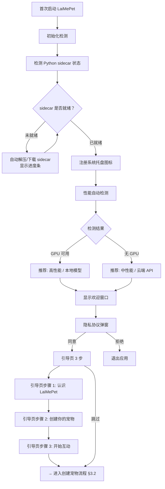
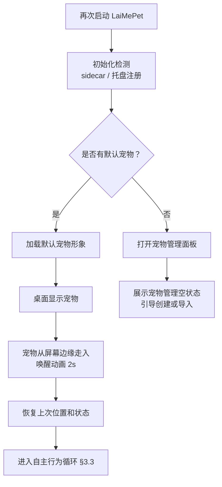
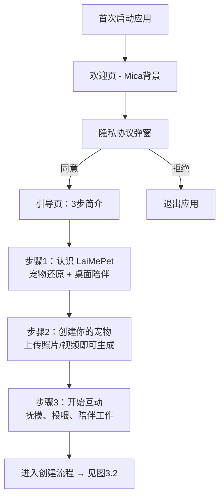
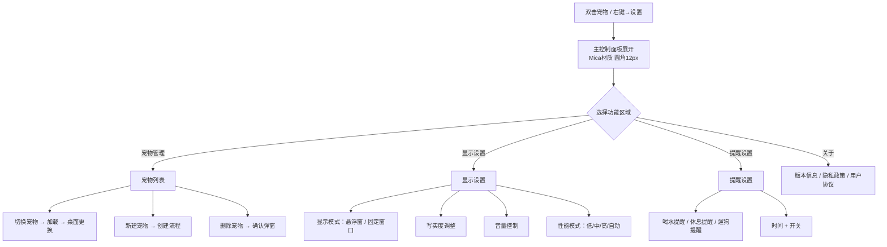
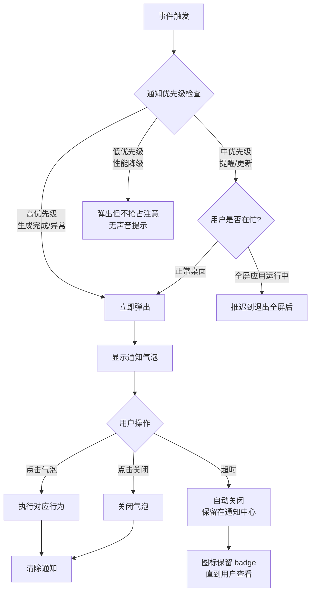

# LaiMePet 交互设计 — V1.1

> **版本**：v1.1
> **日期**：2026-07-04
> **作者**：UI/UX 设计师
> **状态**：评审中（D1+D2+D3+D4 全部完成；L1 自检通过）
> **上一版本**：v1.0 (2026-07-01)
> **变更说明**：D1-术语修正；D2-新增 §3.0 安装+首次启动+二次启动流程；D3-重写 §3.6 系统托盘完整交互（状态机+行为矩阵+Tooltip+通知气泡+最小化到托盘+开机自启+图标规格）+ 新增 §4.11 托盘通知气泡微交互；D4-新增 §3.7 应用更新流程（触发路径+完整流程+优先级分级+下载策略+安装前置检查+失败恢复）
> **依赖**：[design-system.md](design-system.md)

---

## 1. 交互设计原则

| 原则 | 说明 |
|------|------|
| **即时反馈** | 每次用户操作 100ms 内给到视觉反馈，不让用户等待 |
| **渐进呈现** | 常用操作（抚摸）零层级触达；次要操作（设置）渐进展开 |
| **容错可逆** | 误操作可撤销（关闭面板而非确认销毁），不给用户恐慌感 |
| **桌面不打扰** | 自主行为不抢焦点、不弹窗打断工作流（除用户预设提醒）|
| **宠物即界面** | 宠物本体是最主要的交互入口（点击/拖拽/悬停），减少 UI 控件依赖 |

---

## 2. 交互层级模型

```
┌─────────────────────────────────────────┐
│  Layer 0: 桌面自主层（无操作）             │
│  宠物自主行为循环，无 UI                    │
│                                           │
│  Layer 1: 即时互动层（直接操作宠物）         │
│  抚摸(点击) / 投喂(拖拽) → 反应动画         │
│                                           │
│  Layer 2: 悬停发现层（鼠标靠近）             │
│  心情指示器(常驻) + 悬停控制条(浮现)         │
│                                           │
│  Layer 3: 快捷菜单层（右键）                │
│  右键菜单（Acrylic）→ 快捷操作入口          │
│                                           │
│  Layer 4: 完整面板层（双击/托盘）            │
│  主控制面板（Mica）→ 设置、宠物管理          │
└─────────────────────────────────────────┘
```

> **层级递减原则**：从 Layer 0 → Layer 4，操作频率递减，UI 干扰递增。用户 80% 时间停留在 Layer 0-1。

---

## 3. 核心用户流程

### 3.0 安装与首次启动完整流程

#### 3.0.1 下载 → 安装向导

```mermaid
flowchart TD
    A[官网/分发渠道 下载安装包] --> B{安装包类型}
    B -->|.exe 在线安装器| C[下载引导程序<br/>自动拉取最新版本]
    B -->|.msi 离线安装包| D[完整安装包<br/>包含所有依赖]

    C --> E[启动安装向导]
    D --> E

    E --> F[步骤1: 欢迎页]
    F --> F1{检测运行环境}
    F1 -->|缺少 WebView2| F2[提示安装 WebView2 运行时<br/>提供下载链接]
    F1 -->|环境就绪| G
    F2 --> G

    G[步骤2: 许可协议]
    G -->|同意| H[步骤3: 安装路径]
    G -->|拒绝| EXIT1[退出安装]

    H --> H1{路径有效性检查}
    H1 -->|磁盘空间不足| H2[提示所需空间<br/>最低 500MB 空闲]
    H1 -->|路径有效| I

    I[步骤4: 安装进度]
    I --> I1[复制文件 + 注册组件 + 创建快捷方式]
    I1 --> I2{安装结果}
    I2 -->|失败| I3[错误提示 + 重试/取消]
    I3 -->|重试| I
    I2 -->|成功| J

    J[步骤5: 安装完成]
    J --> J1{用户选择}
    J1 -->|勾选"立即启动"| K[启动 LaiMePet]
    J1 -->|不勾选| EXIT2[关闭安装向导]
```

#### 3.0.2 首次启动 → 初始化 → 欢迎引导



#### 3.0.3 二次启动（已有宠物）



---

### 3.1 首次启动 → 创建宠物

> 本节为简化示意，完整首次启动流程（含初始化检测、sidecar 状态检测、性能自动检测、隐私弹窗、引导 3 步）详见 [§3.0.2](#302-首次启动-初始化-欢迎引导)。



### 3.2 创建宠物（核心流程）

```mermaid
flowchart TD
    A[点击"创建我的宠物"] --> B[上传素材界面]
    B --> B1{选择上传方式}
    B1 -->|本地文件| B2[文件选择器<br/>支持 JPG/PNG/MP4/MOV]
    B1 -->|拖拽文件夹| B2
    B2 --> C[素材预览网格]
    C --> C1{质量检查}
    C1 -->|图片 <5张| C2[提示：至少需要5张<br/>当前：N张]
    C2 --> B
    C1 -->|通过| D[写实度配置]
    
    D --> D1[写实度滑块]
    D1 --> D2["0 ←→ 100<br/>左：卡通Q版<br/>右：最大写实"]
    D2 --> D3{选择生成方式}
    D3 -->|本地模型| D4[自动检测硬件<br/>显示预计耗时]
    D3 -->|云端API| D5[显示隐私说明<br/>上传素材到云端]
    
    D4 --> E[点击"开始生成"]
    D5 --> E
    
    E --> F[生成等待页]
    F --> F1[进度动画<br/>骨架屏+阶段提示]
    F1 --> F2{生成结果}
    F2 -->|失败| F3[错误提示+建议]
    F3 -->|补充素材| B
    F3 -->|降低写实度| D
    F3 -->|切换生成方式| D3
    F2 -->|成功| G[形象预览页]
    
    G --> G1[3D宠物旋转预览<br/>可拖拽旋转/滚轮缩放]
    G1 --> G2{满意？}
    G2 -->|不满意| G3[微调选项]
    G3 --> G3a[调整写实度]
    G3 --> G3b[补充更多素材]
    G3a --> E
    G3b --> B
    G2 -->|满意| H[命名 + 确认]
    H --> I[保存形象 → 进入桌面展示]
```

### 3.3 日常桌面展示 + 自主行为

```mermaid
flowchart TD
    A[启动应用] --> B{是否已有宠物？}
    B -->|是| C[加载最近使用的宠物]
    B -->|否| CREATE[创建宠物流程 → 图3.2]
    
    C --> D[宠物出现在桌面]
    D --> E[进入自主行为循环]
    
    E --> E1[行为池随机选取]
    E1 --> E2[平滑过渡动画]
    E2 --> E3[执行行为]
    E3 --> E4[随机等待间隔]
    E4 --> E1
    
    E --> F{心情计时器后台运行}
    F -->|30min 无互动| F1[心情下降一级<br/>行为池偏向"无聊"]
    F1 --> F2[迷你指示器颜色变化]
    F2 --> F
    F -->|发生互动| F3[心情回升<br/>行为池偏向"活泼"]
    F3 --> F2
    
    F -->|60min 无互动| F4[心情继续下降<br/>出现打盹/趴下]
    F4 --> F
    
    F -->|120min 无互动| F5[心情最低<br/>宠物睡觉]
    F5 --> F
```

### 3.4 互动操作详细流程

```mermaid
flowchart TD
    subgraph 抚摸互动
        P1[鼠标移动到宠物区域] --> P2[光标变为手型 👆]
        P2 --> P3[单击宠物身体]
        P3 --> P4[宠物播放被抚摸动画<br/>蹭头/摇尾巴/眯眼/翻身随机]
        P4 --> P5[心情+1]
        P5 --> P6[迷你指示器闪烁开心色]
    end

    subgraph 投喂互动
        F1[悬停控制条出现] --> F2[拖拽食物图标]
        F2 --> F3{拖到宠物区域？}
        F3 -->|是| F4[宠物播放进食动画+开心表情]
        F3 -->|否(松手在其他区域)| F5[食物图标弹回原位]
        F4 --> F6[心情+2]
    end

    subgraph 互动按钮
        B1[悬停控制条/右键菜单] --> B2[点击互动按钮]
        B2 --> B3[展开动作选择面板<br/>握手/转圈/趴下/叫一声]
        B3 --> B4[选择动作]
        B4 --> B5[宠物执行对应动画]
    end
```

### 3.5 设置与切换流程



### 3.6 系统托盘完整交互

> 系统托盘是 LaiMePet **长驻桌面的核心入口**。用户通过托盘控制宠物的显示/隐藏、快速访问设置、接收通知。

#### 3.6.1 托盘图标状态机

```mermaid
flowchart TD
    A[应用启动] --> B[初始化托盘图标]
    B --> C{宠物状态}

    C -->|宠物可见+开心| D[图标: 正常态]
    C -->|宠物可见+无聊| D
    C -->|宠物可见+难过| E[图标: 暗淡态<br/>轻微去饱和度 40%]

    C -->|宠物已隐藏| F[图标: 隐藏态<br/>右下角加小"×"标记]

    C -->|宠物睡觉中| G[图标: 睡眠态<br/>右下角加小"Z"标记]

    C -->|有未读提醒| H[图标: 通知态<br/>右上角橙色圆点 badge]

    C -->|服务异常| I[图标: 错误态<br/>红色感叹号覆盖]

    D --> J{用户操作}
    E --> J
    F --> J
    G --> J
    H --> J
    I --> J

    J -->|单击| K{当前可见性}
    K -->|宠物可见| L[隐藏宠物<br/>图标切换为隐藏态]
    K -->|宠物已隐藏| M[显示宠物<br/>图标切换为正常态<br/>宠物从边缘走入]

    J -->|双击| N[打开主控制面板<br/>若宠物已隐藏则同时显示宠物]

    J -->|右键| O[显示托盘菜单<br/>§6.4 ui-screens]

    %% 自动事件驱动转换
    D -->|宠物心情下降| E
    D -->|120min 无互动| G
    D -->|未读提醒到达| H
    D -->|sidecar 崩溃/服务异常| I
    G -->|鼠标移动/唤醒| D
    I -->|sidecar 自动恢复| D

    L --> F
    M --> D
    N --> D
```

#### 3.6.2 托盘交互行为矩阵

| 操作 | 当前状态 | 行为 | 反馈 |
|------|---------|------|------|
| **单击** | 宠物可见（任意心情） | 宠物播放消失动画（缩小淡出 300ms）→ 隐藏 | 托盘图标切换为"隐藏态" |
| **单击** | 宠物已隐藏 | 宠物从屏幕边缘走入（2s）→ 恢复上次位置 | 托盘图标恢复"正常态" |
| **单击** | 宠物睡觉中 | 不隐藏，改为轻唤醒（宠物抬头 + 伸懒腰） | 图标不变 |
| **双击** | 任意状态 | 打开主控制面板（Mica 面板弹出 300ms） | 宠物若已隐藏 → 同时显示 |
| **中键** | 宠物可见 | 快捷投喂（等同于点击拖拽投喂按钮） | 宠物进食动画 2-3s |
| **右键** | 任意状态 | 显示托盘右键菜单 | 菜单在托盘图标上方弹出 |
| **悬停** | 任意状态 | 显示 Tooltip | 200ms 延迟 |

#### 3.6.3 托盘 Tooltip 内容

```
┌──────────────────────────┐
│ LaiMePet                 │  App 名称 (semibold)
│                          │
│ 🐱 小黄 · 😊 开心        │  宠物名 + 当前心情
│ 上次互动: 3 分钟前        │  最后互动时间
│                          │
│ Ctrl+Shift+P 快速隐藏     │  快捷键提示 (caption灰色)
└──────────────────────────┘
```

**动态内容规则**：

| 场景 | Tooltip 变化 |
|------|-------------|
| 宠物可见 + 开心 | "🐱 小黄 · 😊 开心 — 上次互动: N 分钟前" |
| 宠物可见 + 无聊 | "🐱 小黄 · 😐 无聊 — 快来摸摸它吧" |
| 宠物可见 + 难过 | "🐱 小黄 · 😢 难过 — 已经 N 小时没互动了" |
| 宠物已隐藏 | "🐱 小黄 · 💤 已隐藏 — 单击托盘图标可重新显示" |
| 有未读提醒 | 顶部增加 "🔔 N 条提醒" 行（品牌色） |
| 生成形象进行中 | "⏳ 正在生成形象… 进度 65%" |
| 服务异常 | "⚠️ 服务异常 — 宠物暂时无法响应" |

#### 3.6.4 通知气泡（Windows 原生 Balloon Tip）

**触发条件**：

| 事件 | 通知标题 | 通知正文 | 图标 | 持续时间 | 点击行为 |
|------|---------|---------|------|---------|---------|
| 形象生成完成 | "🎉 宠物形象已生成！" | "小黄的 3D 形象已经准备好，点击查看" | 宠物缩略图 | 10s | 打开形象预览面板 |
| 休息提醒 | "🧘 该休息一下了" | "你已经连续工作 90 分钟，起来活动一下吧" | 品牌图标 | 8s | 宠物展示提醒动画，不打开面板 |
| 喝水提醒 | "💧 记得喝水" | "距离上次喝水已经过去 60 分钟了" | 品牌图标 | 8s | 同上 |
| App 更新可用 | "🆕 发现新版本 v1.1.0" | "包含性能优化和新功能，点击查看详情" | 品牌图标 | 15s | 打开更新面板 |
| 服务异常 | "⚠️ 宠物服务异常" | "Python 引擎意外停止，宠物暂时无法响应。点击尝试恢复" | 警告图标 | 不自动关闭 | 尝试重启 sidecar |
| 性能降级通知 | "⚡ 已切换到节能模式" | "检测到系统资源紧张，已自动降低渲染效果以节省电量" | 品牌图标 | 6s | 无操作 |

**通知生命周期**：



**通知优先级规则**：
| 优先级 | 事件类型 | 是否可推迟 | 是否有声音 |
|--------|---------|-----------|-----------|
| 🔴 高 | 生成完成、服务异常 | 否 | 是（系统默认提示音） |
| 🟡 中 | 用户提醒、版本更新 | 是（全屏时推迟） | 否 |
| 🟢 低 | 性能降级、后台任务完成 | 否 | 否 |

#### 3.6.5 最小化到托盘

```mermaid
flowchart TD
    A[用户操作触发关闭/最小化] --> B{当前显示模式}
    B -->|悬浮窗模式| C{用户操作类型}
    B -->|固定窗口模式| D{用户操作类型}

    C -->|点击托盘"隐藏"| E[宠物缩小淡出 300ms<br/>托盘图标切换隐藏态]
    C -->|按 Ctrl+Shift+P| E
    C -->|按关闭按钮(悬浮窗无标题栏)| E
    C -->|托盘菜单→退出| F[确认弹窗→完全退出]

    D -->|按窗口最小化按钮| G[窗口最小化到任务栏<br/>宠物暂停渲染节约资源]
    D -->|按窗口关闭按钮×| H{设置项: 关闭到托盘?}
    H -->|是(默认)| I[窗口隐藏<br/>自动切换为悬浮窗模式<br/>宠物恢复活动]
    H -->|否| F

    E --> J[后台运行<br/>宠物不可见但心情计时器继续]
    I --> J
    G --> K[后台运行<br/>宠物暂停渲染]

    J --> L{恢复触发}
    L -->|单击托盘| M[宠物从屏幕边缘走入 2s]
    L -->|双击托盘| N[宠物走入+打开控制面板]
    L -->|快捷键 Ctrl+Shift+P| M
```

#### 3.6.6 开机自启 + 静默启动到托盘

```mermaid
flowchart TD
    A[系统开机] --> B{LaiMePet 开机自启?}
    B -->|是| C[静默启动]
    B -->|否| X[不启动]

    C --> C1[初始化 sidecar + 托盘图标]
    C1 --> C2{上次关闭时宠物状态?}
    C2 -->|上次为可见| C3[自动显示宠物<br/>宠物从边缘走入]
    C2 -->|上次为隐藏| C4[仅显示托盘图标<br/>宠物保持隐藏]
    C2 -->|首次开机自启| C4

    C3 --> D[桌面显示宠物]
    C4 --> E[托盘图标显示<br/>Tooltip: "LaiMePet 已在后台运行"]

    D --> F[正常运行]
    E --> F
```

#### 3.6.7 托盘图标设计规格

| 属性 | 说明 |
|------|------|
| 图标尺寸 | 16×16px（任务栏标准）；24×24px（高 DPI） |
| 格式 | `.ico`（多尺寸嵌入） |
| 基础形象 | 宠物剪影 + 品牌暖琥珀色 (#F59E5B) |
| 状态变体 | 正常 / 暗淡(去饱和40%) / 隐藏(+×标记) / 睡眠(+Z标记) / 通知(+橙色圆点badge) / 错误(+红色感叹号) |

> 图标状态 PNG 资源由设计师后续在 `docs/design/assets/tray/` 目录产出。

---

### 3.7 应用更新流程

> 桌面应用通过 Tauri updater 插件检查、下载、安装更新。与 Web 应用不同，**桌面应用更新需要重启进程**以替换二进制文件。更新流程覆盖从发现新版本到完成安装的全链路。

#### 3.7.1 更新触发路径

```mermaid
flowchart TD
    A[更新检测触发] --> B{触发方式}
    B -->|手动检查| C[用户在关于页点击"检查更新"]
    B -->|自动检查| D[应用启动后 60s 静默检查]
    B -->|托盘通知| E[收到更新可用通知 → 点击查看]

    C --> F[显示检查进度]
    D --> G{有可用更新?}
    E --> H[打开更新面板]

    G -->|是| I{更新优先级判断}
    G -->|否| J[静默: 不打扰用户]

    I -->|🔴 强制更新<br/>严重安全修复| K[模态面板<br/>不可关闭/不可推迟]
    I -->|🟡 推荐更新<br/>新功能/性能提升| L[非模态通知<br/>可推迟 24h]
    I -->|🟢 可选更新<br/>小修复/体验优化| M[后台静默下载<br/>托盘 badge 提示]
```

#### 3.7.2 完整更新流程

```mermaid
flowchart TD
    A[发现新版本 vX.X.X] --> B[显示更新通知/面板]
    B --> C{用户决策}

    C -->|"立即更新"| D[开始下载更新包]
    C -->|"稍后提醒"| E[关闭通知 + 设置提醒定时器]
    C -->|"跳过此版本"| F[记录跳过版本号到本地]

    E --> E1{稍后提醒策略}
    E1 -->|🟡 推荐更新| E2[24 小时后再次弹出通知]
    E1 -->|🟢 可选更新| E3[下次启动时再次提醒]

    F --> F1[本次版本周期内不再提醒<br/>手动"检查更新"仍可见]

    D --> D1[显示下载进度]
    D1 --> D2{下载结果}

    D2 -->|成功| G[校验安装包 SHA256]
    D2 -->|网络中断/超时| D3[自动重试：最多 3 次<br/>每次间隔 30s]
    D3 -->|恢复| D1
    D3 -->|3 次均失败| D4[错误提示 + 提供官网下载链接<br/>用户可手动下载 .msi 安装]

    G -->|校验通过| H[安装包就绪]
    G -->|校验失败| G1["⚠ 安全警告：安装包已被篡改<br/>拒绝安装 + 建议从官网重新下载"]

    H --> H1[显示"重启以完成安装"提示]
    H1 --> I{用户选择}

    I -->|"立即重启"| J[保存应用状态 → 关闭 sidecar → 退出应用 → 启动安装程序]
    I -->|"退出时自动安装"| K[保留已下载的安装包<br/>用户下次退出应用时自动执行安装]
    I -->|"下次启动时安装"| L[标记 pending 安装<br/>下次启动前先执行安装再进入应用]

    J --> M[安装程序执行]
    M --> M1[关闭 LaiMePet 所有进程]
    M1 --> M2[替换应用文件 + sidecar]
    M2 --> M3[启动新版本 LaiMePet]
    M3 --> M4[新版本初始化检测 §3.0.2]
    M4 --> M5[宠物恢复上次状态 + 托盘通知: "已更新至 vX.X.X ✨"]
```

#### 3.7.3 更新优先级与用户感知分级

| 优先级 | 类型 | 判定标准 | 用户感知方式 | 可否推迟 | 推迟上限 |
|--------|------|---------|-------------|---------|---------|
| 🔴 **强制** | 严重安全修复、数据完整性修复、不兼容协议变更 | 安全漏洞 CVE 评分 ≥7.0 | 模态面板（不可关闭）+ 托盘图标错误态 | **否** | — |
| 🟡 **推荐** | 重要新功能、显著性能提升（≥20%）、新交互模式 | 版本号 minor 位变化 | 非模态通知 + 关于页红色角标 + 托盘通知气泡 | 是 | 24 小时后再次提醒 |
| 🟢 **可选** | 小修复、体验优化、文案调整 | 版本号 patch 位变化 | 关于页蓝色角标 + 后台静默下载 + 托盘 badge（非抢占） | 是 | 下次启动时提醒 |

**强制更新的体验设计原则**：
- 必须给出清晰的安全理由（"此更新修复了可能导致数据丢失的安全漏洞"），不能只说"请更新"
- 不可关闭但**不阻塞紧急操作**：用户可以先完成当前操作（如正在命名宠物），完成后必须更新
- 提供"保存并更新"一键操作，保护用户当前数据

#### 3.7.4 下载策略

| 策略 | 说明 |
|------|------|
| **静默下载** | 🟢 可选更新：检测到后自动后台下载，完成后仅托盘图标添加通知 badge，不弹出通知气泡 |
| **主动下载** | 🔴 强制 / 🟡 推荐更新：打开更新面板，显示下载进度，用户可见 |
| **断点续传** | 支持断点续传；更新包 >50MB 时分片下载（每片 10MB），网络中断后可续传 |
| **下载限速** | 中性能模式限制 2MB/s；低性能模式限制 1MB/s；避免占用带宽影响用户工作 |
| **完整性校验** | 下载完成后：SHA256 校验 → 数字签名验证 → 校验通过后才标记"可安装" |
| **磁盘预检** | 下载开始前检查磁盘空间 ≥ 安装包大小 × 2（安装包 + 解压临时文件） |

#### 3.7.5 安装前置检查

在开始下载或执行安装前，必须检查以下条件：

| 检查项 | 检查时机 | 不满足时的处理 |
|--------|---------|--------------|
| 磁盘空间 ≥ 安装包 × 2 | 下载开始前 | 提示清理磁盘；估算可释放空间；提供"打开磁盘清理"快捷方式 |
| 无正在进行的生成任务 | 安装执行前 | 等待生成完成后自动继续；若等待 >5min 则提示用户选择"放弃生成并更新"或"完成后更新" |
| 无其他 LaiMePet 实例 | 安装执行前 | 自动关闭旧实例（通过进程互斥锁检测） |
| 应用未在创建宠物流程中 | 安装执行前 | 提示保存当前进度后重试；若为命名确认页则自动保存草稿 |
| sidecar 可正常停止 | 安装执行前 | 强制终止 sidecar 进程（超时 5s 后 kill） |

#### 3.7.6 更新失败恢复策略

```mermaid
flowchart TD
    A[更新失败] --> B{失败阶段}

    B -->|下载阶段| C[自动重试 3 次<br/>间隔 30s]
    C -->|仍失败| C1[提示用户手动下载<br/>提供官网/下载链接]
    C1 --> C2[用户手动安装 .msi<br/>覆盖安装，保留用户数据]

    B -->|校验阶段| D[拒绝安装 + 安全警告]
    D --> D1[自动清理已下载文件]
    D1 --> D2[提示从官网重新下载]
    D2 --> D3[上报异常到服务端]

    B -->|安装阶段| E[安装程序回滚]
    E --> E1{回滚结果}
    E1 -->|回滚成功| E2[恢复旧版本<br/>提示"更新未完成，已恢复到上一版本"<br/>保留用户数据不受影响]
    E1 -->|回滚失败| E3[严重: 提示用户重新安装<br/>提供 .msi 下载链接<br/>**用户数据仍在 %APPDATA% 中安全保留**]

    B -->|启动阶段| F[新版本无法启动]
    F --> F1[自动回退到旧版本备份]
    F1 --> F2[恢复旧版本 + 提示<br/>"新版本启动异常，已回退"]
    F2 --> F3[自动上报崩溃日志]
```

#### 3.7.7 更新相关微交互

| 场景 | 交互 | 参数 |
|------|------|------|
| 关于页"检查更新"点击 | 按钮变为旋转环 loading 态 + "正在检查…" | 100ms 过渡 |
| 检查到新版本 | 关于页"检查更新"行右侧出现红色圆点 badge | badge 4px，品牌红色 |
| 下载进度 | 更新面板内进度条 + 百分比 + 下载速度 + 预计剩余时间 | 实时更新（500ms 轮询） |
| 下载完成 | 进度条变绿色 + ✓ "已就绪" + "重启以完成安装"按钮变为 Primary | 进度条颜色过渡 300ms |
| 安装中 | 托盘图标消失 → 短暂等待（2-5s）→ 新版本托盘图标出现 + 宠物从边缘走入 | — |
| 更新完成 | 托盘通知气泡：✨ "已更新至 vX.X.X" + 首次启动展示新功能摘要（What's New） | 通知驻留 10s |

---

## 4. 微交互定义

### 4.1 点击抚摸

| 属性 | 值 |
|------|-----|
| 触发器 | 鼠标在宠物身体区域按下左键并释放（click） |
| 前置条件 | 宠物不在睡觉/进食动画中 |
| 即时反馈 | 按下时宠物轻微缩放（scale: 0.95），100ms |
| 结果动画 | 随机播放以下之一：蹭头（头向鼠标方向微倾）、摇尾巴（尾骨 3 次摆动）、眯眼（眼睛闭 500ms）、翻身露肚皮（整个模型翻转）|
| 动画时长 | 800-1500ms（取决于动作类型）|
| 后置效果 | 心情值 +1；若心情已满，则触发特殊开心动画（转圈跳）|
| 冷却时间 | 无（可连续抚摸），但 5 秒内第 3 次抚摸触发"摸太多了"反应（宠物躲开 200px，2 秒后返回）|
| 音效 | 宠物轻哼声（若有声音素材），音量跟随系统设置 |
| 性能降级 | 低性能模式：仅摇尾巴一种动画，无缩放反馈 |

### 4.2 悬停控制条

| 属性 | 值 |
|------|-----|
| 触发器 | 鼠标进入宠物 bounding box 区域 |
| 延迟出现 | 悬停 300ms 后浮现（避免误触，日常移动鼠标不触发）|
| 出现动画 | 从宠物上方淡入 + 上移 8px（`--duration-normal` 300ms, `--ease-out`）|
| 消失动画 | 鼠标离开宠物 + 控制条区域后 500ms，淡出 + 下移 8px（`--ease-in`）|
| 位置 | 宠物 bounding box 上方 12px，水平居中（跟随宠物移动实时更新）|
| 内容 | 4 个图标按钮：抚摸 🤚 / 投喂 🍖 / 互动 🎾 / 设置 ⚙ |
| 悬停按钮 | 按钮背景变 `brand-100`，100ms 过渡 |
| 点击按钮 | 按钮按下缩放 `0.92`，100ms → 回弹 + 触发对应功能 |
| 性能降级 | 低性能：无延迟直接出现，无动画，简化色块背景 |

### 4.3 右键菜单

| 属性 | 值 |
|------|-----|
| 触发器 | 鼠标在宠物或桌面宠物区域右键单击 |
| 出现位置 | 鼠标点击位置，如在屏幕边缘则自动内收 |
| 出现动画 | 从点击位置向外扩展 + 淡入（200ms, `--ease-out`）|
| 消失 | 点击菜单项 / 点击菜单外 / Esc → 淡出 150ms |
| 项悬停 | 背景变为 `brand-100`，100ms 过渡 |
| 项点击 | 300ms 内执行对应操作，菜单关闭 |
| 子菜单 | "宠物列表" → 右箭头 + hover 200ms 展开子菜单 |
| 分隔线 | 分组之间 1px 线 |
| 性能降级 | 低性能：无动画直接出现，无亚克力模糊 |

### 4.4 迷你心情指示器

| 属性 | 值 |
|------|-----|
| 位置 | 始终在宠物 bounding box 右上角外 4px 处 |
| 常态 | 8px 圆点 + 4px 外发光，颜色跟随心情 |
| 开心态 | 间歇弹性跳动（`--ease-spring`, 缩放 1→1.3→1, 300ms, 周期 3s）|
| 无聊态 | 缓慢明暗呼吸（opacity 0.6→1→0.6, 周期 5s）|
| 难过态 | 微光暗淡 + 偶尔下沉 2px（周期 8s）|
| 互动瞬间 | 闪烁品牌色 500ms + 缩放 1.5x 回弹 |
| 可点击 | 点击指示器 = 等同于点击宠物（抚摸）|

### 4.5 拖动投喂

| 属性 | 值 |
|------|-----|
| 触发器 | 在悬停控制条上按下食物图标并拖拽 |
| 拖拽过程 | 食物图标跟随鼠标，放大 1.2x + `--shadow-md`，原位置显示虚线占位 |
| 有效区域 | 宠物身体 bounding box（高亮微妙发光提示）|
| 松手在有效区 | 食物图标缩小飞入宠物嘴部 → 进食动画开始 |
| 松手在无效区 | 食物图标弹性弹回原位（`ease-bounce`, 400ms）|
| 进食动画 | 宠物低头 + 咀嚼循环（3 次）+ 吞咽 + 开心表情 |
| 进食时长 | 约 2-3 秒 |
| 冷却 | 投喂后 60 秒冷却，期间食物图标灰色禁用 |
| 性能降级 | 低性能：无拖拽，改为点击食物图标直接触发 |

### 4.6 互动按钮面板

| 属性 | 值 |
|------|-----|
| 触发器 | 点击悬停控制条"互动"按钮 |
| 出现 | 从按钮位置展开小型动作面板（宽 140px），Acrylic 材质，4 个动作按钮纵向排列 |
| 动作 | 🤝 握手 / 🔄 转圈 / 🐾 趴下 / 🗣️ 叫一声 |
| 选择 | 点击动作 → 面板关闭 150ms + 宠物执行动画 |
| 动画时长 | 握手：1.5s / 转圈：2s / 趴下：1s（趴下后保持）/ 叫一声：1s |
| 点击外部 | 面板关闭 150ms |
| 性能降级 | 低性能：简化面板无亚克力 |

### 4.7 主控制面板

| 属性 | 值 |
|------|-----|
| 触发器 | 双击宠物 / 右键→"设置" / 托盘→"设置" |
| 出现动画 | 从宠物位置缩放弹出（scale: 0.8→1 + fade in, 300ms, `ease-out`）|
| 位置 | 屏幕中央偏右（不遮挡宠物）|
| 尺寸 | 400×520px（固定）|
| 材质 | Mica，圆角 12px，`--shadow-lg` |
| 内部导航 | 左侧 Tab 栏（宠物管理/显示设置/提醒设置/关于）|
| Tab 切换 | 内容区交叉淡入淡出（200ms）|
| 关闭 | 点击面板外 / 右上角关闭按钮 / Esc → 缩小淡出（200ms, `ease-in`）|
| 拖拽 | 标题栏可拖拽移动面板位置 |

### 4.8 Toast 通知

| 属性 | 值 |
|------|-----|
| 触发器 | 系统事件（生成完成、提醒时间到、错误发生）|
| 进入 | 从屏幕右上角滑入 + 淡入（300ms, `--ease-out`）|
| 驻留 | 5 秒停留（提醒类可配置更长）|
| 退出 | 滑出 + 淡出（200ms, `--ease-in`）|
| 堆叠 | 多个通知在 Y 轴堆叠，间距 8px，最多同时显示 3 个 |
| 点击 | 跳转到相关功能（如"生成完成"→打开预览）|
| 手动关闭 | 悬停出现关闭按钮 → 点击关闭 |

### 4.9 确认弹窗

| 属性 | 值 |
|------|-----|
| 触发器 | 执行不可逆操作（删除宠物、退出应用）|
| 出现 | 遮罩淡入 200ms + 弹窗缩放淡入 300ms（`scale: 0.95→1`）|
| 内容 | 标题(h2) + 警告文案 + 取消(Secondary) + 确认(Danger) |
| 聚焦 | 默认聚焦于"取消"按钮（防误操作）|
| 确认 | 点击确认 → 执行操作 + 弹窗关闭 |
| 取消 | 点击取消 / Esc / 点击遮罩 → 弹窗关闭 |
| 退出动画 | 弹窗缩小淡出 200ms（`ease-in`） + 遮罩延迟淡出 |

### 4.10 宠物切换过渡

| 属性 | 值 |
|------|-----|
| 触发器 | 选择不同宠物 |
| 当前宠物 | 淡出 + 缩小（300ms, `ease-in`）|
| 间隔 | 200ms 空桌面 |
| 新宠物 | 淡入 + 从下方轻微弹入（400ms, `ease-bounce`）|
| 总时长 | 约 900ms |

### 4.11 系统托盘通知气泡

| 属性 | 值 |
|------|-----|
| 触发器 | 后台事件（生成完成、提醒到时、更新可用、服务异常） |
| 出现位置 | Windows 任务栏托盘区域上方（系统原生定位） |
| 出现动画 | 从任务栏向上滑出 + 淡入（由 Windows 系统控制，约 200ms） |
| 驻留时间 | 高优先级 10-15s / 中优先级 8-10s / 低优先级 6s |
| 退出 | 超时自动滑回消失；用户点击气泡或关闭按钮立即消失 |
| 暂停条件 | 全屏应用运行时，中优先级通知延迟到退出全屏后弹出 |
| 声音 | 仅高优先级通知播放系统默认提示音（尊重 Windows 静音/专注模式设置） |
| 点击行为 | 执行关联操作（见 §3.6.4 通知触发表） |
| 通知中心 | 所有通知同步写入 Windows 通知中心（操作中心），用户可回溯历史通知 |

**通知内容模板**：

| 类型 | 标题格式 | 正文格式 | 图标 |
|------|---------|---------|------|
| 生成完成 | "🎉 {宠物名} 形象已生成" | "3D 形象已准备就绪，点击查看" | 宠物缩略图 |
| 提醒 | "{emoji} {提醒名称}" | "{提醒描述}" | 品牌图标 |
| 更新 | "🆕 发现新版本 v{版本号}" | "{更新摘要}" | 品牌图标 |
| 异常 | "⚠️ {异常简短描述}" | "{恢复建议}" | 警告图标 |

**不发出通知的事件**（静默处理）：
- 心情变化
- 宠物行为切换
- 设置保存成功（仅 Toast 展示）
- 性能模式自动切换（首次通知，后续静默）

---

## 5. 鼠标/光标行为

| 场景 | 光标样式 | 说明 |
|------|---------|------|
| 桌面空白区域 | `default`（箭头）| 点击穿透到下方应用 |
| 悬停在宠物身体上 | `pointer`（手型 👆）| 提示可互动 |
| 悬停在宠物脸部 | `pointer` + 宠物眼睛跟随光标 | 亲和力 |
| 拖拽投喂中 | `grabbing`（抓住）| 食物跟随光标 |
| 拖拽到有效区域 | `grabbing` + 宠物高亮光晕 | 视觉确认 |
| 在控制面板内 | `default` → `pointer`（按钮上）| 标准 UI 行为 |
| 等待/加载中 | 自定义旋转环（宠物爪印图案）| 品牌化等待指示器 |
| 文本输入 | `text`（I 型光标）| 命名、设置输入 |
| 悬停托盘图标 | `default` + 200ms 后显示 Tooltip | 系统原生行为 |

---

## 6. 状态反馈规范

### 6.1 加载状态

| 场景 | 反馈方式 | 预估时长 |
|------|---------|---------|
| 应用冷启动 | 托盘图标先出现 → 宠物从屏幕边缘走入（2s）→ 就绪 | 2-5 秒 |
| 生成宠物形象 | 骨架屏 + 阶段提示文字（"提取特征…→ 生成模型…→ 绑定骨骼…"），进度环 | 1-5 分钟 |
| 切换宠物 | 当前宠物缩小淡出 → 短暂空桌面 → 新宠物弹入 | <1 秒 |
| 设置保存 | 按钮变为加载态（旋转环）+ "保存中…" → "已保存 ✓" | <1 秒 |

### 6.2 空状态

| 场景 | 反馈方式 |
|------|---------|
| 无宠物（首次使用）| 欢迎页引导创建 |
| 宠物列表为空 | 插图 + "还没有宠物，创建一个吧" + CTA 按钮 |
| 搜索/筛选无结果 | 轻量提示 |

### 6.3 错误状态

| 场景 | 反馈方式 |
|------|---------|
| 素材质量不足 | 模态提示："部分照片无法识别宠物，建议更换清晰照片" + 列出问题照片（红色边框）|
| 生成失败 | Toast 错误通知 + 面板内错误文案 + 建议（降低写实度 / 换云端 / 补充素材）|
| 网络断开（云端模式）| Toast 警告 "网络连接已断开" + 自动切换到本地模型提示 |
| 硬件不满足最低要求 | 启动时弹窗提示 + 自动设置为低性能模式 |

### 6.4 成功状态

| 场景 | 反馈方式 |
|------|---------|
| 宠物创建成功 | Toast 成功 + 宠物在桌面中央出现 + 开心开场动画（转圈 + 摇尾）|
| 设置保存 | 按钮短暂显示"✓ 已保存"（2s 后恢复）|
| 素材上传完成 | 每张照片缩略图显示绿色勾选 |

### 6.5 边界状态

| 场景 | 处理方式 |
|------|---------|
| 多显示器 | 宠物跟随当前活跃显示器；切换显示器时宠物走到新屏幕边缘再出现 |
| 显示器分辨率变化 | 宠物重新定位到桌面右下角安全区域 |
| 全屏应用运行 | 宠物自动隐藏（不遮挡全屏内容），退出全屏后恢复 |
| 锁屏 / 睡眠 | 宠物进入睡觉状态；唤醒后伸懒腰动画恢复 |
| 系统资源紧张 | 自动降级到低性能模式，托盘通知 "已切换到节能模式" |

---

## 7. 动效参数汇总

| 编号 | 动效 | 触发 | 时长 | 缓动 | 性能降级 |
|------|------|------|------|------|---------|
| A01 | 宠物自主行走 | 行为池选取 | 2-5s（循环）| linear | 低：4 帧步进 |
| A02 | 宠物趴下/伸懒腰 | 行为池选取 | 1.5-3s | ease-out | 低：直接切换姿态 |
| A03 | 抚摸反应 | 点击宠物 | 0.8-1.5s | ease-bounce | 低：仅摇尾巴 0.5s |
| A04 | 进食动画 | 投喂成功 | 2-3s | ease-default | 低：简化咀嚼 1s |
| A05 | 心情指示器跳动 | 开心态循环 | 300ms/周期 | ease-spring | 低：无动画 |
| A06 | 控制条浮现 | 悬停 300ms | 300ms | ease-out | 低：直接出现 |
| A07 | 控制条消失 | 鼠标离开 | 500ms延迟+200ms | ease-in | 低：直接消失 |
| A08 | 右键菜单出现 | 右键单击 | 200ms | ease-out | 低：无动画 |
| A09 | 面板弹出 | 双击宠物 | 300ms | ease-out | 低：无缩放 |
| A10 | 面板关闭 | 点击外部/Esc | 200ms | ease-in | 低：直接关闭 |
| A11 | Toast 滑入 | 事件触发 | 300ms | ease-out | 低：直接出现 |
| A12 | 弹窗出现 | 确认操作 | 300ms | ease-out | 低：无动画 |
| A13 | 宠物切换 | 选择不同宠物 | 旧出300 + 新入400 | ease-bounce | 低：直接切换 |
| A14 | 睡觉渐入 | 120min 无互动 | 2s 渐变过渡 | ease-default | 保留（情感核心）|
| A15 | 睡眠唤醒伸懒腰 | 鼠标移动/点击 | 1.5s | ease-bounce | 保留（情感核心）|
| A16 | 按钮悬停 | hover | 100ms | ease-default | 保留 |
| A17 | 按钮按下 | active | 100ms | ease-default | 保留 |
| A18 | 食物拖拽跟随 | 拖拽食物 | 实时 (60fps) | 无 | 低：取消拖拽 |
| A19 | 食物弹回 | 松手在无效区 | 400ms | ease-bounce | 取消 |
| A20 | 食物飞入嘴部 | 松手在有效区 | 200ms | ease-in | 取消 |
| A21 | 子菜单展开 | 右键菜单项 hover | 200ms | ease-out | 低：直接显示 |
| A22 | 面板 Tab 切换 | 点击 Tab 标签 | 200ms | ease-default | 低：直接切换 |
| A23 | Toast 退出 | 5s 自动消失/手动关闭 | 200ms | ease-in | 低：直接消失 |
| A24 | 弹窗退出 | 点击取消/Esc | 200ms | ease-in | 低：直接关闭 |
| A25 | 托盘通知气泡出现 | 事件触发 → Windows 原生 | ~200ms | 系统控制 | N/A（原生） |
| A26 | 宠物躲开（摸太多） | 5s 内第 3 次点击 | 躲开 200ms + 2s 返回 | ease-bounce | 低：取消躲开 |
| A27 | 握手动画 | 互动→握手 | 1.5s | ease-out | 低：简化 0.5s |
| A28 | 转圈动画 | 互动→转圈 | 2s | ease-default | 低：简化 0.8s |
| A29 | 趴下动画 | 互动→趴下 | 1s | ease-out | 低：直接切换 |
| A30 | 叫一声动画 | 互动→叫一声 | 1s | ease-bounce | 低：简化 0.5s |
| A31 | 指示器明暗呼吸 | 无聊态循环 | 5s/周期 | ease-default | 低：无动画 |
| A32 | 指示器缓慢下沉 | 难过/饥饿态 | 8s 缓慢下沉 4px | ease-in | 低：保持静态 |

---

## 8. 键盘快捷键

| 快捷键 | 操作 | 说明 |
|--------|------|------|
| `Ctrl + Shift + P` | 显示/隐藏宠物 | 快速隐藏（会议/分享屏幕时）|
| `Ctrl + Shift + F` | 投喂 | 快捷投喂，无需鼠标 |
| `Ctrl + Shift + S` | 打开设置 | 打开主控制面板 |
| `Ctrl + Shift + ←/→` | 切换宠物 | 多宠之间切换 |
| `Esc` | 关闭当前面板/菜单 | 逐层关闭 |

---

## 9. 性能分级交互适配

| 交互 | 高性能 (60fps) | 中性能 (30fps) | 低性能 (15fps) |
|------|--------------|--------------|--------------|
| 宠物骨骼动画 | 流畅全身骨骼 | 减帧（隔帧渲染）| 4-6 帧精灵图切换 |
| 毛发光影 | 动态光照计算 | 烘焙静态光照 | 无光影 |
| 粒子效果 | 开心时星星粒子 | 无 | 无 |
| UI 材质 | Acrylic 实时模糊 | Mica 静态采样 | 纯色背景 |
| UI 过渡 | 全部弹性过渡 | 默认缓动 | 无动画直接切换 |
| 拖拽投喂 | 实时跟随 + 弹性效果 | 实时跟随 | 改为点击触发 |
| 阴影 | 全部层级阴影 | 仅 sm/md | 无阴影 |

---

## 10. 与 PRD 用户故事对应

| PRD 故事 | 对应交互 |
|---------|---------|
| US-01 上传照片生成形象 | §3.2 创建宠物流程 |
| US-02 写实度滑块调节 | §3.2 写实度配置 + §4.7 控制面板 |
| US-03 桌面自主行为 | §3.3 自主行为循环 |
| US-04 点击抚摸 | §4.1 点击抚摸微交互 |
| US-05 显示模式切换 | §3.5 设置 → 显示模式 |
| US-06 互动按钮触发动作 | §4.6 互动按钮面板 |
| US-07 拖拽投喂 | §4.5 拖动投喂微交互 |
| US-08 心情状态 | §3.3 心情计时器 + §4.4 指示器 |
| US-09 多宠切换 | §3.5 宠物管理 + §4.10 切换过渡 |
| US-10 宠物叫声 | §4.6 互动按钮"叫一声"|
| US-11 提醒功能 | §3.5 提醒设置 + §4.8 Toast |
| US-12 配饰系统 | P2，V1.0 暂不覆盖 |

---

> **下一阶段**：界面设计描述 — 输出每个界面的高保真布局、组件摆放、状态覆盖。（`ui-screens.md`）
