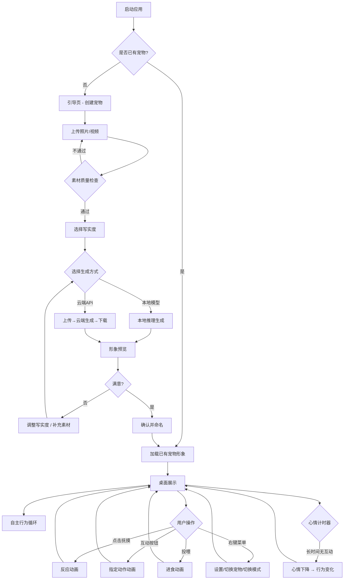

# 桌面宠物应用 PRD — LaiMePet V1.1

> **版本**：v1.1  
> **日期**：2026-07-04  
> **作者**：产品经理  
> **状态**：✅ 已确认 — 产品方向已修正为桌面原生应用，进入设计阶段  
> **上一版本**：v1.0 (2026-06-30)  
> **变更说明**：产品形态从 Web 页面修正为桌面原生应用；新增跨平台路线图；新增安装/分发方式说明

---

## 1. 产品背景与目标

### 产品名称
**LaiMePet**（来觅宠物）— 把真实宠物带进你的桌面

### 产品形态
**桌面原生应用**（非 Web 页面），基于 Tauri v2 框架构建：
- 当前平台：**Windows 10/11**（`.msi` / `.exe` 安装包）
- 后续扩展：macOS → iOS → Android
- 技术架构：Tauri v2（Rust 桌面壳）+ React（内嵌 WebView UI）+ Python FastAPI（AI 推理 sidecar）
- 用户获取方式：下载安装包 → 安装 → 桌面运行，**不依赖浏览器**

### 产品背景
- 家庭养宠人群日益庞大，宠物是重要的情感寄托
- 主人上班、出差时无法与宠物相处，存在陪伴空白
- 宠物寿命有限（通常 10-15 年），无法终身陪伴
- 传统虚拟宠物（QQ 宠物等）形象单一，无法还原真实宠物特征

### 产品目标

| 阶段 | 目标 | 核心能力 |
|------|------|---------|
| **V1.0** 宠物电子化 | 通过照片/视频 AI 还原宠物 3D 形象，桌面端实时互动 | 形象生成 + 桌面互动 |
| **V2.0** 虚实联动 | 接入穿戴设备数据，远程查看宠物实时状态 | IoT 数据同步 |
| **V3.0** 数字永生 | 长期行为记录与学习，宠物离世后以数字形态延续陪伴 | 行为建模 + 记忆留存 |

### V1.0 成功指标
- 从上传照片到生成可互动形象的完成率 ≥ 80%
- 用户次日留存 ≥ 40%
- 平均每日互动时长 ≥ 15 分钟
- 形象还原满意度评分 ≥ 4.0/5
- 安装包体积 ≤ 150MB（基础安装包，模型按需下载）

### V1.0 跨平台路线图

| 阶段 | 平台 | 预计时间 | 技术方案 | 说明 |
|------|------|---------|---------|------|
| **Phase 1** | Windows | 当前 | Tauri v2 + React + FastAPI sidecar | `.msi` / `.exe` 安装包 |
| **Phase 2** | macOS | Phase 1 完成后 | 同代码库，Tauri macOS 构建 | `.dmg` 安装包，代码复用率 ≥ 90% |
| **Phase 3** | iOS | Phase 2 完成后 | SwiftUI 原生 + 复用 FastAPI 云端 | 移动端需独立开发 UI 层 |
| **Phase 4** | Android | Phase 3 并行 | Kotlin/Jetpack Compose + 复用云端 | 与 iOS 共享后端 API

---

## 2. 目标用户与场景

### 目标用户

| 画像 | 描述 |
|------|------|
| **核心用户** | 25-45 岁，有真实宠物的上班族，养猫/狗为主 |
| **扩展用户** | 喜欢宠物但因条件限制无法饲养的人群 |

### 使用场景
- **工作陪伴**：宠物在桌面右下角活动，工作时偶尔互动减压
- **外出挂念**：出差/旅行时打开电脑，看到宠物形象缓解思念
- **宠物记忆**：记录宠物特征和行为习惯，形成数字档案

---

## 3. 用户故事（V1.0）

### P0（必须有 — MVP 核心）

| 编号 | 用户故事 | 验收标准 |
|------|---------|---------|
| US-01 | 作为用户，我希望能上传宠物的照片/视频，系统自动生成与真实宠物相似的 3D 桌面形象 | Given 用户上传 ≥5 张清晰照片，When 点击"生成形象"，Then 系统在 3 分钟内生成可识别的宠物 3D 形象 |
| US-02 | 作为用户，我希望能调节形象的写实程度，找到最适合我设备和审美的平衡点 | Given 形象已生成，When 拖动写实度滑块，Then 形象实时变化（卡通 ← 0~100 → 写实） |
| US-03 | 作为用户，我希望宠物在桌面窗口/悬浮窗中展示动态行为（走动、趴下、伸懒腰等） | Given 形象已加载，When 观察 ≥5 分钟，Then 宠物至少展示 3 种以上的自主行为 |
| US-04 | 作为用户，我希望能点击抚摸宠物，宠物对此有反应动画 | Given 宠物在桌面上，When 鼠标点击宠物身体区域，Then 宠物展示被抚摸的反应动画（摇尾巴/蹭头/眯眼） |
| US-05 | 作为用户，我希望能切换显示模式（桌面悬浮窗 / 固定窗口） | Given 当前处于任一模式，When 右键菜单切换模式，Then 切换为另一种显示模式，宠物状态不中断 |

### P1（应该有 — 增强体验）

| 编号 | 用户故事 | 验收标准 |
|------|---------|---------|
| US-06 | 作为用户，我希望能通过互动按钮触发宠物特定动作（握手、转圈、叫一声） | Given 点击互动按钮，When 选择动作，Then 宠物执行对应动画，1~3 秒内完成 |
| US-07 | 作为用户，我希望能投喂虚拟食物给宠物 | Given 拖动食物图标到宠物区域，When 松开，Then 宠物展示进食动画 |
| US-08 | 作为用户，我希望宠物有简单的心情状态（开心/无聊/饥饿），会根据互动频率变化 | Given 超过 30 分钟无互动，When 观察宠物，Then 宠物展示无聊/打盹等状态 |
| US-09 | 作为用户，我希望能多创建几个宠物形象（多宠家庭），并在它们之间切换 | Given 已有 ≥2 个宠物形象，When 在列表中选择，Then 桌面展示切换到选中的宠物 |

### P2（可有 — 锦上添花）

| 编号 | 用户故事 | 验收标准 |
|------|---------|---------|
| US-10 | 作为用户，我希望宠物能发出真实叫声（基于原宠物声音样本） | Given 用户上传了声音样本，When 触发叫声，Then 发出与真实宠物相似的叫声 |
| US-11 | 作为用户，我希望宠物在特定时间提醒我（喝水、休息、该遛狗了） | Given 设置了提醒时间，When 到达时间，Then 宠物展示提醒动画+文字气泡 |
| US-12 | 作为用户，我希望能给宠物佩戴虚拟配饰（围巾、帽子等） | Given 进入装扮界面，When 选择配饰，Then 配饰正确佩戴在宠物模型上 |

---

## 4. 功能详细说明

### 4.1 形象生成模块

| 项目 | 说明 |
|------|------|
| **触发条件** | 用户进入"创建宠物"流程，上传 ≥5 张照片或 ≥1 段视频 |
| **前置条件** | 已安装应用，同意隐私协议 |
| **处理流程** | 上传素材 → 预处理（去噪、关键帧提取）→ AI 模型推理（特征提取：毛色/体型/面部/花纹）→ 绑定骨骼动画 → 输出 3D 模型 |
| **写实度控制** | 0-100 滑块，0=Q版卡通化，50=半写实，100=最大写实（取决于本地算力） |
| **异常处理** | 照片质量不足→提示重拍；素材中无宠物→提示重新上传；生成超时→提供降级方案（预置模板匹配） |
| **边界条件** | 最少 5 张照片，最多 50 张；视频最长 60 秒；支持格式 JPG/PNG/MP4/MOV |

### 4.2 桌面展示模块

| 项目 | 说明 |
|------|------|
| **悬浮窗模式** | 宠物在桌面上方自由活动，窗口透明无边框，点击穿透非宠物区域，支持拖拽调整位置 |
| **固定窗口模式** | 类似桌面小组件，有边界框，宠物在框内活动，窗口可最小化到系统托盘 |
| **自主行为池** | 空闲走动、趴下休息、伸懒腰、打哈欠、舔毛、追逐尾巴、看窗外、挠痒 |
| **动画过渡** | 行为切换时平滑过渡，无跳帧 |

### 4.3 互动模块

| 互动方式 | 触发 | 宠物反应 |
|---------|------|---------|
| 抚摸 | 鼠标点击宠物身体 | 蹭头/摇尾巴/眯眼/翻身露肚皮（随机） |
| 投喂 | 拖拽食物到宠物区域 | 进食动画 + 开心表情 |
| 互动按钮 | 点击按钮选择动作 | 执行握手/转圈/趴下/叫一声 |
| 心情系统 | 后台计时 | 开心 → 无聊 → 难过（梯度变化） |

### 4.4 设置模块

- 写实度滑块
- 显示模式切换
- 音量控制（叫声、环境音）
- 开机自启开关
- 本地模型 / 云端 API 切换
- 性能模式（低/中/高，影响动画帧率和渲染质量）

---

## 5. 用户流程图

---

## 6. 非功能性需求

| 类别 | 要求 |
|------|------|
| **性能** | 空闲时 CPU ≤3%，内存 ≤200MB；生成形象时 GPU 占用合理 |
| **启动速度** | 冷启动 ≤5 秒（不含首次模型加载） |
| **兼容性** | **Windows**：Windows 10/11，WebView2 运行时（Win11 已内置）；**macOS**：macOS 12+（后续版本） |
| **安装包** | Windows `.msi`/`.exe`，≤150MB（基础包），模型文件按需下载 |
| **分发方式** | 独立安装包下载，非浏览器访问；自带 Python 运行时（sidecar） |
| **隐私** | 用户照片默认本地处理，仅在用户选择云端 API 时上传；不上传任何数据至第三方 |
| **可访问性** | 支持高对比度模式、键盘操作 |
| **安全性** | 本地数据加密存储，云端传输 HTTPS + 加密 |

---

## 7. 数据指标定义

| 指标 | 当前值 | V1.0 目标 | 数据来源 |
|------|--------|----------|---------|
| 形象生成完成率 | — | ≥80% | 客户端埋点 |
| 次日留存率 | — | ≥40% | 客户端埋点 |
| 日均互动时长 | — | ≥15 分钟 | 客户端埋点 |
| 形象满意度评分 | — | ≥4.0/5 | 应用内评分弹窗 |
| 付费转化率 | — | ≥5% | 支付系统 |

---

## 8. 风险与假设

| 风险 | 影响 | 缓解措施 |
|------|------|---------|
| 本地 AI 模型对低配机器不友好 | 形象生成失败/过慢 | 提供云端 API 降级方案；根据硬件自动降低写实度 |
| 3D 还原度不足导致用户失望 | 留存差 | 引导用户上传高质量素材；设置合理预期；写实度可调 |
| 长时间桌面运行消耗资源被用户关闭 | 使用时长低 | 轻量化渲染；性能模式；闲时降低帧率 |
| 版权/内容安全风险 | 用户上传侵权图片 | 隐私协议 + 本地优先处理 + 不上传原始图片 |
| 真实宠物照片涉及敏感数据 | 隐私合规风险 | 本地模型默认不联网；隐私声明明确数据处理方式 |

---

## 9. V1.0 迭代计划

| Sprint | 周期 | 目标 | 主要任务 |
|--------|------|------|---------|
| Sprint 1 | 第 1-2 周 | 技术验证 ✅ 已完成 | Tauri v2 项目骨架 ✅、3D 渲染方案 ✅、AI 模型可行性验证（DashScope ✅） |
| Sprint 2 | 第 3-4 周 | 形象生成 MVP ✅ 已完成 | 照片上传→AI 推理→3D 模型生成流水线 ✅、写实度调节（设计中） |
| Sprint 3 | 第 5-7 周 | 桌面原生化 + 基础互动 | **`tauri dev` 启动原生窗口**（替代浏览器 dev server）、FastAPI sidecar 集成、悬浮窗透明模式、骨骼动画、抚摸互动 |
| Sprint 4 | 第 8-9 周 | 互动增强 + 设置 + 打包 | 互动按钮、投喂、心情系统、设置模块、系统托盘、**`.msi`/`.exe` 安装包构建** |
| Sprint 5 | 第 10-11 周 | 测试 + 优化 | 功能测试、性能优化（低配机适配）、安装包测试 |
| Sprint 6 | 第 12 周 | 内测发布 | Windows 安装包内测分发、收集反馈、Bug 修复 |
